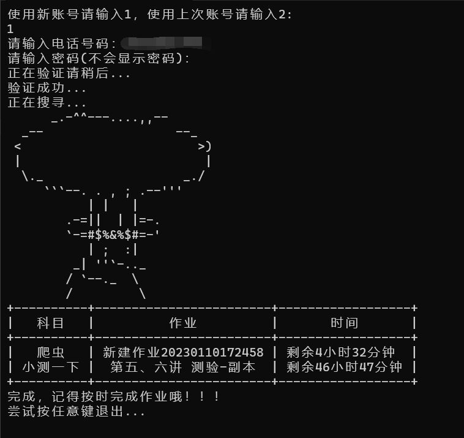
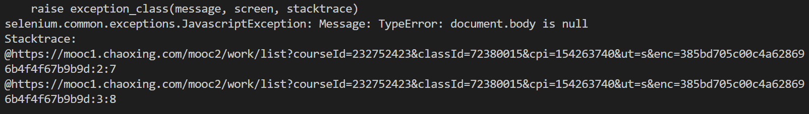

基于selenium模块实现浏览器模拟登录超星平台爬取作业截止日期爬虫脚本😊
=====
## ❤️说明❤️

你还在为每天到处找不到作业而忘记提交而担忧吗？你还在为每次一个个寻找作业而烦恼吗，你还在每天担心作业过期吗？想解放双手吗

快来试试他吧！！😊😊😊

### 1、原码获取

```git
git clone git@github.com:2567176308/chaoxingworkTime.git
```

#### or

```git
直接Download ZIP
```


### 2、命令行运行

<strong><em>在获取原码的前提下</em></strong>

1、安装环境请看<em>第四步</em>
2、安装FireFox浏览器utils文件中有firefox安装包，默认安装即可
3、请移步这里[geckodriver](https://github.com/mozilla/geckodriver/releases)下载geckodriver,不同操作系统下载对应新驱动，解压后将原有驱动(我的firefox是108版本区别不太大是可以正常运行的)替换即可
4、进入chaoxing目录输入``` python main.py```


### 3、直接运行

<strong><em>请跳过1、2步</em></strong>

1直接移步这里[chaoxingWorkWin64](https://github.com/2567176308/chaoxingworkTime/releases)下载文件，解压进入目录点击main.exe即可



### 4、环境

```py
Python3.10
安装包环境：
在已有python环境的前提下
进入chaoxing目录输入
pip install -r requirements.txt
```


### 5、存在问题

出现类似以下问题纯属正常情况```ctrl+c```退出重新运行即可



    本爬虫还不够完善，欢迎大家指导
    可以直接修改源码
    如果存在错误或者爬取不全面的情况
    1、在超星首页创建新文件夹并将其他没用或者过期课程移至新文件夹中
    2、其他活动课程也不要放在根目录也一并移至新文件夹

